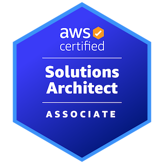

# Hi there, I'm Naveen Addanki 👋
## About Me
I am an **AI/ML Engineer** specializing in Machine Learning, Generative AI, LLM Fine-tuning & RAG Systems. With hands-on experience building end-to-end AI solutions, my work bridges practical deployments and groundbreaking research. My goal is to translate complex AI advancements into high-impact products.

🎓 **Indiana University Bloomington — M.S. Data Science**  
GPA: 3.9/4.0 | Aug 2023 - May 2025
- Key Courses: Reinforcement Learning, Computer Vision, Applied Algorithms, Data Management

## 🚀 What I Do
- Develop **agentic RAG systems** and real-time data pipelines, enabling lightning-fast, data-driven insights for analysts.
- Fine-tune advanced LLMs (DPO, RLHF, LoRA), leading projects that boost model accuracy and efficiency.
- Engineer robust **Conversational & Generative AI applications** from vision to production—with hands-on skills in LangChain, Streamlit, Hugging Face, and more.
- Orchestrate reliable, scalable cloud deployments with Docker, Kubernetes, and CI/CD across AWS, Azure, and GCP.
- Advocate for best practices in MLOps, model/data drift monitoring, and explainable AI.

## 💻 Experience
### Graduate AI Research Engineer  
*Indiana University O'Neill School of Public and Environmental Affairs — Jun 2025–Present*
- Built a real-time agentic RAG system leveraging vector databases and FastAPI.
- Embedded 5,000+ SEC filings & news articles for hybrid retrieval, powering interactive dashboards and chatbot Q&A.
- Tools: Python, FastAPI, Streamlit, FAISS, Azure AI, LangSmith, Ragas

### Graduate LLM Research Engineer  
*Indiana University Luddy School of Informatics — Jan 2025–Jul 2025*
- Fine-tuned SD XL1.5 and LLaMA-3-8B for multimodal origami image generation and sentiment analysis.
- Managed large annotation teams and deployed scalable web AI applications, achieving 85%+ accuracy.
- Tools: Python, Streamlit, Hugging Face, Deepspeed, RLHF, LoRA

### Graduate Generative AI Engineer  
*Indiana University Eskenazi School of Art, Architecture + Design — May 2024–Dec 2024*
- Built real-time Voice AI with RAG and graph-enhanced knowledge, powering thousands of rich voice interactions.
- Dockerized CI/CD pipelines and orchestrated semantic search, reducing irrelevant AI responses by 30%.
- Tools: LangChain, Neo4j, Pinecone, Docker, CI/CD

### Program Analyst, ML & ETL  
*Cognizant — Sep 2021–Jul 2023*
- Developed ETL workflows transforming 7M+ daily records for analytics and ML.
- Automated CI/CD and MLOps for robust, production-ready deployments across cloud platforms.
- Tools: Pandas, FastAPI, Informatic, MLflow, PowerBI, AWS/GCP

## 🌟 Projects
- [**VibeAI**](https://github.com/naveenaddanki84/vibeAI_saas): No-code AI-powered app builder (NextJS, React, OpenAI)
- [**Secure LLM Fine-tuning & Deployment**](https://github.com/naveenaddanki84/Text-Classification-Dataset-and-Fine-Tuning-with-Pretrained-Language-Model): Robust LLM training with Unsloth, QLoRA, TextAttack, deployed on Kubernetes with advanced CI/CD.
- [**Hybrid Anime Recommendation System**](https://github.com/naveenaddanki84/Hybrid_Anime_Recommendation_system): End-to-end recommender with Flask, GCP, and advanced MLOps
- [**Trading Platform with AI Agents**](https://github.com/naveenaddanki84/MCP-Trading-Platform-with-Multi-Server-Integration): Agentic GPT-4/Claude/Gemini trading simulation with multi-server integration

## ⚡ Languages and Technologies

## 🎖 Credentials & Certifications
  
**AWS Certified Solutions Architect – Associate**

**Additional Certifications:**
- AWS Certified ML Engineer
- Deep Learning Specialization
- Azure AI-900/AZ-900

## 📫 Reach Me
- [Email](mailto:addankinaveen84@gmail.com)
- [LinkedIn](https://www.linkedin.com/in/naveenaddanki/)
- [GitHub](https://github.com/naveenaddanki84)
- [Portfolio](https://www.datascienceportfol.io/addankinaveen84)
